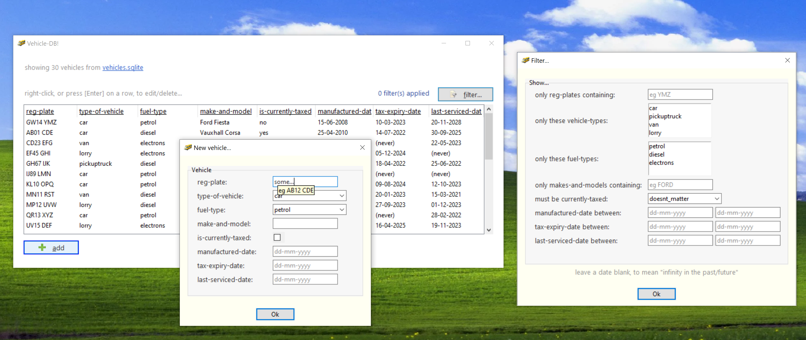
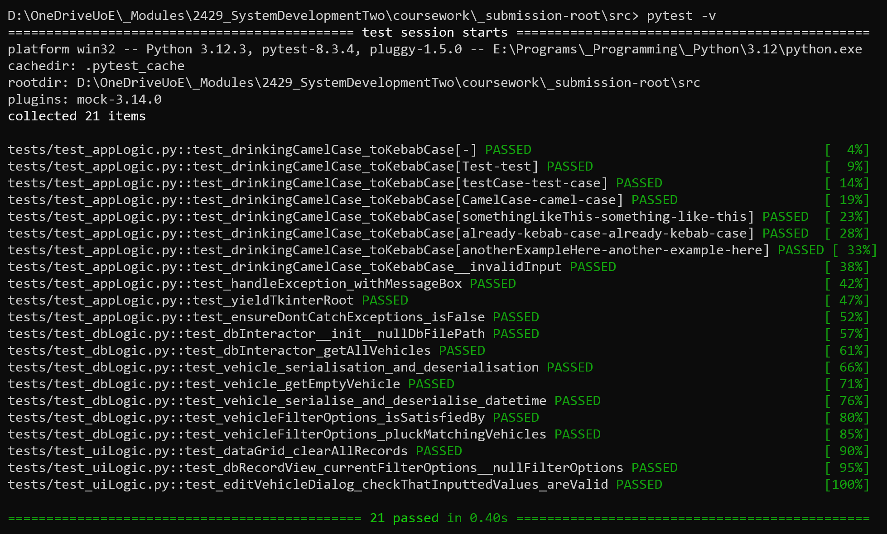
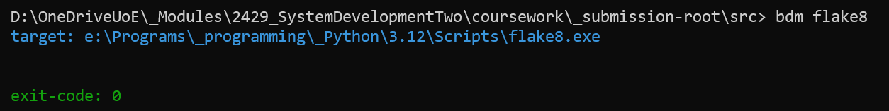
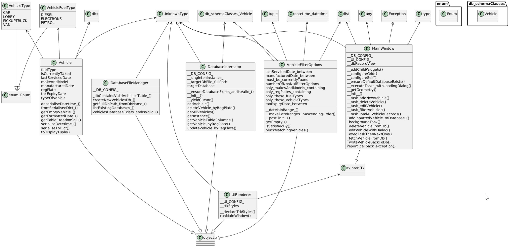
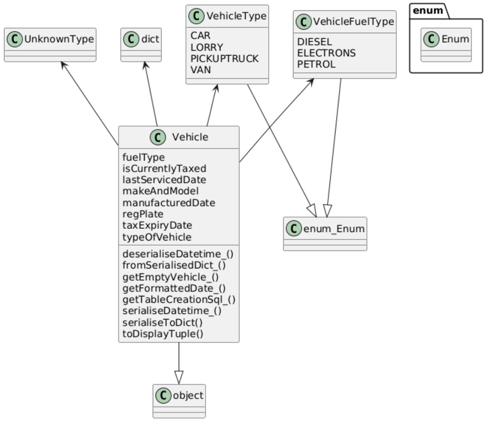
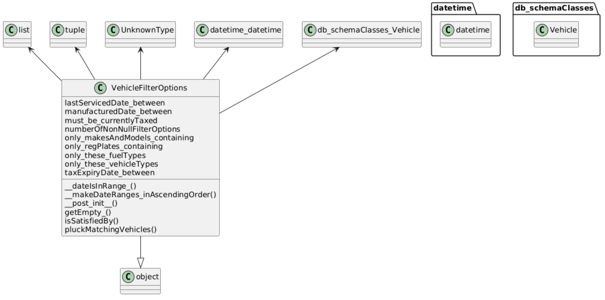
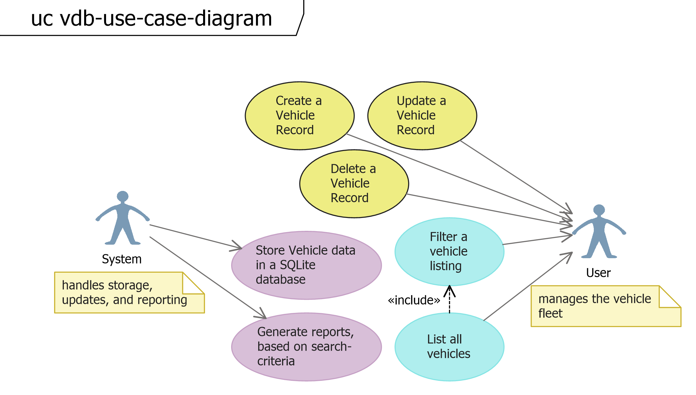

Vehicle-DB!
===========
**Ben Mullan**

This documents Vehicle-DB; a simple, neat-and-tidy desktop database CRUD application which permits creating, editing, deleting, and filtering vehicles records.

The project comprises a tkinter GUI, an underlying sqlite3 database, pytest for unit-testing, and is written for **Python 3.12**. The UI is designed to be user-friendly, with a simple interface. Extensibility is provided with a configurable ``config.ini`` file for changing settings such as the target database file, and a highly modular codebase with rigerously-defined type-safe interfaces (in so far as Python allows).

See the "Declaration of AI usage" in ``readme-please-and-ai-declaration.txt`` for information hereto.

.. raw:: html

   

Demonstration images
--------------------

   **The application running**

   **All unit-tests passing**

   **`flake8` runs with no warnings (uses the root dir's `.flake8` file)**

.. raw:: html

   

To run this software...
-----------------------

.. raw:: html

    <pre style="color: red; font-weight: bold;">
            !!!!!!!!!!!!!!!!!!!!!!!!!!!!!!!!!!!!!!!!!!!!!!!!!!!!
            IMPORTANT: Do NOT run the following in PowerShell;
            it BREAKS some of the unit-tests - just use `cmd`.
            !!!!!!!!!!!!!!!!!!!!!!!!!!!!!!!!!!!!!!!!!!!!!!!!!!!!
    </pre>
     

.. code-block::

    *assuming*:         Python 3.12+, Windows 10+
    1) change dir:      cd into\the\extracted\zip\
    2) run program:     python main.pyw
    3) pre-reqs:        python -m pip install -r requirements.txt
    4) style-check:     python -m flake8 .
    5) unit-tests:      python -m pytest .

.. raw:: html

   

Class & use-case diagrams
-------------------------

   **Component-diagram, of the most important classes**

   **UML class-diagram of Vehicle**

   **UML class-diagram of VehicleFilterOptions**

   **UML use-case diagram, for whole system**

.. raw:: html

   

Naming conventions
------------------

.. code-block::

    The codebase names identifiers thusly...
    
        •  Classes
        •  publicMembers
        •  __privateMembers
        •  _localVariables
        •  publicStaticMembers_
        •  __privateStaticMembers_
        •  _localStaticVariables_
        •  CONSTANTS

.. raw:: html

   

What data...?
-------------

.. code-block::

    This software implements the following schema:

        [Vehicle]
            - regPlate          * : string
            - typeOfVehicle     * : string enum {car, pickupTruck, van, lorry}
            - fuelType          * : string enum {diesel, petrol, electrons}
            - makeAndModel      * : string
            - isCurrentlyTaxed  * : boolean
            - manufacturedDate  * : datetime
            - taxExpiryDate       : datetime
            - lastServicedDate    : datetime

    And to filter vehciles:

        [VehicleFilterOptions]
            - only_regPlates_containing       : string
            - only_these_vehicleTypes         : array-of <string enum {car, pickupTruck, van, lorry}>
            - only_these_fuelTypes            : array-of <string enum {diesel, petrol, electrons}>
            - only_makesAndModels_containing  : string
            - must_be_currentlyTaxed          : boolean
            - manufacturedDate_between        : tuple-of <datetime, datetime>
            - taxExpiryDate_between           : tuple-of <datetime, datetime>
            - lastServicedDate_between        : tuple-of <datetime, datetime>

    (* = cannot be null)
    see: /data/_create-vehicles-table.sql

.. raw:: html

   

.. toctree::
    :maxdepth: 4
    :caption: The entire codebase...

    db_dbFileManager
    db_dbInteractor
    db_schemaClasses
    db_vehicleFilterOptions
    ui_c_dataGrid
    ui_c_dataSourceLabel
    ui_c_dbRecordView
    ui_c_editVehicleDialog
    ui_c_filterVehiclesDialog
    ui_c_floatingToolTip
    ui_c_imageButton
    ui_c_loadingDialog
    ui_c_mainWindow
    ui_c_textboxWithPlaceholder
    ui_uiRenderer
    app_configProvider
    app_constants
    app_errorHandling
    app_filesysUtils
    classDiagramOf_everything

.. automodule:: logic
    :members:
    :undoc-members:
    :show-inheritance:

.. automodule:: logic.db_dbFileManager
   :members:
   :undoc-members:
   :private-members:
   :special-members: __init__
   :show-inheritance:

.. automodule:: logic.db_dbInteractor
   :members:
   :undoc-members:
   :private-members:
   :special-members: __init__
   :show-inheritance:

.. automodule:: logic.db_schemaClasses
   :members:
   :undoc-members:
   :private-members:
   :special-members: __init__
   :show-inheritance:

.. automodule:: logic.db_vehicleFilterOptions
   :members:
   :undoc-members:
   :private-members:
   :special-members: __init__
   :show-inheritance:

.. automodule:: logic.ui_c_dataGrid
   :members:
   :undoc-members:
   :private-members:
   :special-members: __init__
   :show-inheritance:

.. automodule:: logic.ui_c_dataSourceLabel
   :members:
   :undoc-members:
   :private-members:
   :special-members: __init__
   :show-inheritance:

.. automodule:: logic.ui_c_dbRecordView
   :members:
   :undoc-members:
   :private-members:
   :special-members: __init__
   :show-inheritance:

.. automodule:: logic.ui_c_editVehicleDialog
   :members:
   :undoc-members:
   :private-members:
   :special-members: __init__
   :show-inheritance:

.. automodule:: logic.ui_c_filterVehiclesDialog
   :members:
   :undoc-members:
   :private-members:
   :special-members: __init__
   :show-inheritance:

.. automodule:: logic.ui_c_floatingToolTip
   :members:
   :undoc-members:
   :private-members:
   :special-members: __init__
   :show-inheritance:

.. automodule:: logic.ui_c_imageButton
   :members:
   :undoc-members:
   :private-members:
   :special-members: __init__
   :show-inheritance:

.. automodule:: logic.ui_c_loadingDialog
   :members:
   :undoc-members:
   :private-members:
   :special-members: __init__
   :show-inheritance:

.. automodule:: logic.ui_c_mainWindow
   :members:
   :undoc-members:
   :private-members:
   :special-members: __init__
   :show-inheritance:

.. automodule:: logic.ui_c_textboxWithPlaceholder
   :members:
   :undoc-members:
   :private-members:
   :special-members: __init__
   :show-inheritance:

.. automodule:: logic.ui_uiRenderer
   :members:
   :undoc-members:
   :private-members:
   :special-members: __init__
   :show-inheritance:

.. automodule:: logic.app_configProvider
   :members:
   :undoc-members:
   :private-members:
   :special-members: __init__
   :show-inheritance:

.. automodule:: logic.app_constants
   :members:
   :undoc-members:
   :private-members:
   :special-members: __init__
   :show-inheritance:

.. automodule:: logic.app_errorHandling
   :members:
   :undoc-members:
   :private-members:
   :special-members: __init__
   :show-inheritance:

.. automodule:: logic.app_filesysUtils
   :members:
   :undoc-members:
   :private-members:
   :special-members: __init__
   :show-inheritance: